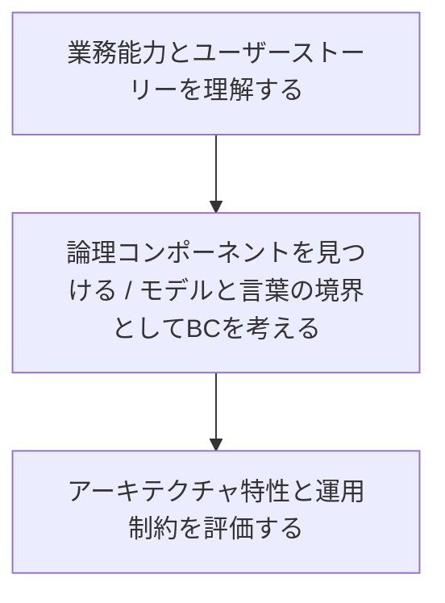

# 論理コンポーネントとDDDの区切られた文脈から始めるマイクロサービス境界設計

## はじめに

新しいシステムの設計を始めるとき、つい最初から次のような話をしたくなります。

* この機能はマイクロサービスにするべきか
* データベースはサービスごとに分けるべきか
* 非同期イベントで連携するべきか
* フロントエンドとバックエンドをどの単位でデプロイするべきか

しかし、これらはすべて**物理アーキテクチャ**の問いです。サービス、データベース、UI、デプロイ単位といった「実際にどう配置し、どう運用するか」の話であり、その前に考えるべき問いがあります。

> システムは何をするのか。機能はどのように分かれ、互いにどう協調するのか。

本稿では、『ソフトウェアアーキテクチャの基礎 第2版』のコンポーネントベース思考と、『ドメイン駆動設計をはじめよう』の区切られた文脈（Bounded Context。以下、BC）の考え方を手がかりに、**技術方式を決める前に境界を考える方法**を整理します。

結論から言うと、設計の順序は次のように考えるのが自然です。

1. 論理コンポーネントによって、業務機能と責務の分割を考える
2. BCによって、モデルと言葉の一貫性が保たれる境界を考える
3. アーキテクチャ特性や運用上の制約を踏まえて、物理的な分離を判断する

## いきなり物理アーキテクチャから考えない

物理アーキテクチャとは、サービス、UI、データベース、メッセージブローカー、デプロイ単位など、システムを実際に構成する要素とその配置です。

たとえば受注システムを設計するとき、最初から「注文サービス」「在庫サービス」「決済サービス」を個別にデプロイすると決めてしまうと、その分割は技術構成としては明確でも、業務上の責務が妥当かどうかはまだ分かりません。

* 注文受付と注文履行は同じ境界でよいのか
* 在庫引当と補充発注は同じ機能なのか
* 通知は注文だけに属するのか、それとも配送や決済からも利用されるのか
* 決済失敗時の再試行や返金は、どの責務に属するのか

これらを整理しないままサービスやDBを分割すると、「なぜこの境界なのか」が説明できないまま、ネットワーク越しの連携とデータ整合性の難しさだけを抱えることになります。

そこで先に考えるのが**論理アーキテクチャ**です。

論理アーキテクチャでは、デプロイ方法とは切り離して、システムの主要なビジネス機能を論理コンポーネントとして整理します。受注システムであれば、次のようなコンポーネントが候補になります。

| 論理コンポーネント             | 主な責務           |
| --------------------- | -------------- |
| Order Placement       | 注文内容の受付と検証     |
| Order Fulfillment     | 梱包・履行処理の管理     |
| Inventory Management  | 在庫引当・在庫調整・補充判断 |
| Payment Processing    | 支払い適用・失敗処理・返金  |
| Order Shipment        | 出荷指示・追跡情報の管理   |
| Customer Notification | 注文・決済・配送状況の通知  |

この時点では、これらが単一アプリケーション内のモジュールなのか、独立サービスなのか、同一DBを共有するのかは決めません。まずは「システムの能力」と「責務の境界」を明確にします。

## 論理コンポーネントは一度で完成しない

論理コンポーネントは、最初に名前を並べて終わるものではありません。初期候補を作り、要件やユーザーストーリーを割り当て、責務やアーキテクチャ特性を分析しながら、繰り返し再構成していくものです。


*出典：『ソフトウェアアーキテクチャの基礎 第2版』第8章*

重要なのは、最初の分割を正解だと思い込まないことです。要件を割り当てた結果、責務が集中しすぎたり、複数コンポーネントから同じ機能が必要になったり、求められる可用性やスケーラビリティが異なることが見えてきます。その発見を境界の見直しに反映させます。

## 初期の論理コンポーネントを見つける：アクター／アクションアプローチ

初期コンポーネントを発見する代表的な方法の一つが、**アクター／アクションアプローチ**です。

システムに関わるアクターと、そのアクターが実行する主要な行為を洗い出し、行為を担う能力のまとまりをコンポーネント候補として見つけます。

受注システムなら、たとえば次のように整理できます。

| アクター     | アクション              | コンポーネント候補             |
| -------- | ------------------ | --------------------- |
| 顧客       | 商品を検索する            | Product Catalog       |
| 顧客       | 注文を確定する／キャンセルする    | Order Placement       |
| 顧客       | 配送状況を確認する          | Order Shipment        |
| オーダーパッカー | 箱サイズを決め、梱包完了を記録する  | Order Fulfillment     |
| システム     | 在庫を引き当て、必要なら補充発注する | Inventory Management  |
| システム     | 支払いを適用し、失敗を処理する    | Payment Processing    |
| システム     | 注文・配送状況をメール通知する    | Customer Notification |

ここで注目したいのは、コンポーネント名が「モノ」ではなく「能力」や「業務上の目的」を表していることです。

### アンチパターン：エンティティの罠

コンポーネントを見つけるときに避けたいのが、エンティティ名をそのままコンポーネント名にしてしまう設計です。

```text
Customer Manager
Item Manager
Order Manager
```

一見すると自然ですが、`Order Manager` という名前からは、注文受付をするのか、履行を管理するのか、出荷を追跡するのか、返金を扱うのかが分かりません。

このようなコンポーネントには、やがて次のような処理が集まりがちです。

* 注文の検証
* 注文履歴の参照
* 梱包・出荷の管理
* 支払い処理
* 在庫調整
* 顧客への通知

その結果、「注文に関係するものは何でも入る」巨大なコンポーネントになります。変更理由が複数に増え、テスト範囲が広がり、将来的な分割も難しくなります。

`Manager`、`Controller`、`Handler`、`Processor`、`Engine` といった曖昧な接尾辞が悪いわけではありません。しかし、名前を読んでも具体的な業務責務が説明できない場合は、エンティティの罠に陥っていないかを疑うべきです。

## ユーザーストーリーを割り当てて、責務を具体化する

初期のコンポーネント名は、まだ空のバケツにすぎません。その境界が妥当かを判断するには、実際のユーザーストーリーや要件を割り当てます。

| ユーザーストーリー／要件            | 割り当て先                 |
| ----------------------- | --------------------- |
| 注文内容を検証し、注文IDを採番する      | Order Placement       |
| 商品に応じた箱サイズを決定する         | Order Fulfillment     |
| 注文確定時に在庫を引き当てる          | Inventory Management  |
| クレジットカード決済を適用する         | Payment Processing    |
| 出荷後に追跡番号を記録する           | Order Shipment        |
| 注文受付・決済失敗・出荷完了をメールで知らせる | Customer Notification |

この割り当てを行うと、いくつかの重要な兆候を発見できます。

### 既存のどこにも自然に入らない要件がある

たとえば、注文受付後のメール通知を `Order Placement` に入れたとしても、やがて決済失敗通知や発送完了通知も必要になります。通知処理が複数コンポーネントに重複し始めるなら、`Customer Notification` のような独立した能力として扱うサインです。

### 一つのコンポーネントに異なる変更理由が集まっている

`Order Placement` が注文検証だけでなく、決済事業者との連携、在庫引当ルール、メールテンプレート管理まで担っているなら、そのコンポーネントは複数の理由で変更されます。業務ルールの変化が互いに干渉し、凝集度が下がっている可能性があります。

## コンポーネントが責務を持ちすぎていないかを確認する

コンポーネントに要件を割り当てたら、次に見るべきは**凝集度**です。凝集度とは、コンポーネントに含まれる責務が、どれだけ密接に関連しているかを表します。

たとえば `Order Placement` に次の責務が割り当てられていたとします。

* 注文内容を検証する
* 配送先住所を確定する
* 注文IDを生成する
* 支払いを適用する
* 在庫を調整する
* 注文概要をメール送信する

いずれも「注文時に発生する処理」ではあります。しかし、支払いルール、在庫ルール、通知ルールは、それぞれ独立して変化しやすい関心事です。

この場合、次のように分割することで、各コンポーネントの責務が明確になります。

- Order Placement
  - 注文内容を検証する
  - 配送先住所を確定する
  - 注文IDを生成する
- Payment Processing
  - 支払いを適用する
- Inventory Management
  - 在庫を調整する
- Customer Notification
  - 注文概要をメール送信する

責務を文章にしたとき、「および」「さらに」「また」といった接続詞が増えるなら、異なる変更理由を一つの境界に押し込めていないかを確認するとよいでしょう。

## 境界は機能だけでは決まらない：アーキテクチャ特性を考える

責務の凝集度だけで、最終的な境界が決まるわけではありません。可用性、スケーラビリティ、耐障害性、弾力性、セキュリティ、変更容易性などの**アーキテクチャ特性**も、コンポーネントの再構成に影響します。

たとえば、同じ「ユーザー入力を処理する」機能でも、次の二つでは要求が異なります。

| 機能         | 想定利用者         | 重視される特性          |
| ---------- | ------------- | ---------------- |
| 顧客向け注文受付   | セール時に数千人が同時利用 | スケーラビリティ、可用性、弾力性 |
| 社内向け受注補正画面 | 数人の担当者が利用     | 操作性、監査性、変更容易性    |

機能上は近く見えても、必要な品質特性が大きく違うなら、論理コンポーネントを分ける判断が妥当になることがあります。

逆に、機能名が違っても、常に同時に変更され、同一のモデルを共有し、同じ品質特性で十分なら、初期段階で無理に細分化しない方がよい場合もあります。

ここまでの議論で重要なのは、**物理分割の判断より前に、責務と品質特性に基づく論理的な境界を明確にする**ことです。

## DDDの区切られた文脈：モデルと言葉が一貫する境界

論理コンポーネントが「システムの能力と責務」を考えるための視点だとすると、DDDのBCは、**モデルと言葉の意味が一貫して通用する範囲**を考えるための視点です。

たとえば「見込み客」という言葉は、業務部門によって意味が異なります。

| 文脈   | 「見込み客」の意味                     |
| ---- | ----------------------------- |
| 販売促進 | 連絡先を伴う関心の通知。キャンペーンや流入元と結び付く対象 |
| 営業   | 商談化、提案、成約可能性など、営業活動全体を管理する対象  |

同じ言葉であっても、販売促進と営業では必要な属性もライフサイクルも異なります。これを一つの巨大な `Prospect` モデルに統一しようとすると、一方の都合による変更が他方に波及し、モデルは次第に理解しづらくなります。

BCの考え方では、組織全体で一つの意味に無理に統一するのではなく、**それぞれの文脈の内側で言葉とモデルを一貫させる**ことを重視します。

## 区切られた文脈は「小さければよい」わけではない

マイクロサービスを意識し始めると、BCも最初からできるだけ小さくしたくなるかもしれません。しかし、境界がまだ不明確な段階で小さく切りすぎると、かえって変更コストが増えます。

たとえば、業務理解が浅いまま注文受付、値引計算、在庫引当、配送条件判定をすべて別の文脈として扱ったとします。その後、実際にはこれらが同じ業務ルールで頻繁に同時変更されると分かれば、一つの仕様変更のたびに複数境界をまたいだ調整が必要になります。

初期段階では、次の方針が現実的です。

* まずはモデルと言葉が一貫する、やや広めのBCとして設計する
* 業務理解が進み、異なる変更理由や異なるモデルが安定して見えてから分割する
* 中核領域と頻繁に協調する能力は、早すぎる物理分離を避ける

論理的に整理された内部境界を後で分割する方が、境界の意味が不明なまま物理的に分離したサービスを後から統合するよりも扱いやすいからです。

## 論理コンポーネントとBCは同じものか

ここで、論理コンポーネントとBCの関係をどう捉えるかが問題になります。

筆者としては、両者は**完全に同一ではないが、整合しうる**と考えています。

| 観点       | 論理コンポーネント        | 区切られた文脈（BC）           |
| -------- | ---------------- | --------------------- |
| 主な関心     | システムが提供する業務機能・責務 | モデルと言葉の一貫性            |
| 問い       | 何を担う能力として分けるか    | どの範囲で同じ意味のモデルを使えるか    |
| 境界を疑う兆候  | 責務過多、低凝集、品質特性の差  | 同じ用語の意味の衝突、モデルの不自然な共有 |

たとえば一つの `Order Management` というBCの内部に、`Order Placement`、`Order Fulfillment`、`Order Cancellation` といった複数の論理コンポーネントが存在することは自然です。それらが同じ注文モデルと言語を共有し、同時に変更されることが多い段階では、同一BC内のモジュールとして保つ方が分かりやすいかもしれません。

一方、`Payment Processing` が決済事業者、返金、与信、監査といった独自のモデルと言語を持つなら、注文とは別のBCとして扱う理由が強くなります。

つまり、論理コンポーネントで**責務の候補**を見つけ、BCで**モデル境界としての妥当性**を検証する、という使い方ができます。

## マイクロサービス境界の上限と下限

『ドメイン駆動設計をはじめよう』では、DDDの概念がマイクロサービスの妥当な境界を考える助けになることが説明されています。

| DDDの概念        | マイクロサービス境界との関係             |
| ------------- | -------------------------- |
| 区切られた文脈（BC）   | 有効な境界の最も広い側、すなわち上限を考える手がかり |
| 集約（Aggregate） | 有効な境界の最も狭い側、すなわち下限を考える手がかり |


*出典：『ドメイン駆動設計をはじめよう』第14章*

BCをまたいで巨大な一つのサービスにまとめ続けると、異なるモデルと言葉が混在する**大きな泥団子**になりやすくなります。

反対に、集約よりも細かな単位でサービスを乱立させると、一つの整合性を保つために多数のネットワーク呼び出しや分散トランザクションが必要になり、**分散した泥団子**になりかねません。

ここで大切なのは、「BCごとに必ず一サービスにする」という機械的なルールではありません。BCと集約は、サービス粒度について考えるための制約と判断材料であり、最終的な物理分割は運用要件やチーム構造、変更頻度、障害分離の必要性と合わせて判断します。

## BCの内側ではコードを共通化してよいのか

BC内ではユビキタス言語とモデルの意味が揃っているため、コードの共通化は比較的行いやすいと考えます。

たとえば、一つのBC内をマルチモジュール構成にし、ドメインモデルや業務ルールを共有しながら、必要に応じて一部の実行単位だけを別プロセスとしてスケールさせる設計はあり得ます。

```text
OrderManagement Context
├── order-domain          # 共通する注文モデルとルール
├── order-api             # 同期APIの受付
└── order-event-consumer  # 非同期イベント処理
```

この場合、物理的には複数のデプロイ単位に分かれていても、モデル境界としては同一BCです。逆に、BCをまたいでドメインモデルやテーブル構造を安易に共有すると、言葉と責務の境界が曖昧になり、独立した変更が難しくなります。

なお、BC内であっても共有ライブラリのリリース依存や同時デプロイの強制が強くなれば、運用上の結合は増えます。コードを共有できることと、常に共有すべきことは別問題です。

## 技術要因で分割する場合も、BCを先に考える

実際の設計では、言語、ランタイム、非同期処理、セキュリティ境界、外部サービス連携、スケーリング要件など、技術的な理由で実行単位を分けることもあります。

たとえば、画像変換処理だけを高性能な別ランタイムで実行したい、決済処理だけをより厳格なネットワーク境界に置きたい、大量通知だけを非同期ワーカーとして水平スケールさせたい、といった判断です。

このような物理分割自体は妥当です。ただし、技術都合の分割を先に置くと、複数のBCの責務が一つのサービスに混ざったり、逆に一つのBCが理由なく細切れになったりします。

したがって順序としては、次のように考えるのが安全です。



先にBCと論理責務を整理しておけば、物理的に分割する場合でも「このサービスは何の境界を実装しているのか」を説明できます。

## 単一DBで始める場合も、BCを意識する

BCは、マイクロサービスを導入するときだけ必要な概念ではありません。単一のアプリケーションや単一DBで始める場合にも有用です。

初期段階では、運用コストや開発速度の観点から、モジュラーモノリスと単一DBを選ぶことは十分に合理的です。ただし、すべてのテーブルを自由に結合し、すべてのモジュールが自由に更新できる設計にすると、後から境界を分けることが難しくなります。

たとえば、次のようなルールを設けるだけでも、将来の選択肢を残しやすくなります。

* テーブルやスキーマの所有者をBC単位で明確にする
* 別BCのデータを直接更新せず、公開されたユースケースやイベントを介して連携する
* 別BCの内部モデルをそのまま参照モデルとして流用しない
* 境界をまたぐ結合やトランザクションを可視化し、例外として管理する

物理的には一つのDBであっても、論理的な所有権とモデル境界を守ることで、将来サービス分割が必要になった場合の移行コストを抑えられます。

## まとめ：境界は「どうデプロイするか」より前に考える

マイクロサービス、イベント駆動、DB分割といった選択肢は、いずれも強力です。しかし、それらは境界を発見する方法そのものではありません。境界が不明確なまま物理分割を進めると、システムは分散しただけで理解しづらくなります。

本稿で整理した要点は次の通りです。

* まず論理コンポーネントとして、システムの能力と責務を整理する
* 初期コンポーネントは、ユーザーストーリー、凝集度、アーキテクチャ特性をもとに反復的に再構成する
* `Order Manager` のようにエンティティをそのまま曖昧な責務の箱にしない
* BCによって、モデルと言葉が一貫する境界を捉える
* 論理コンポーネントとBCは同一ではないが、責務とモデル境界を両面から考えるうえで整合する
* マイクロサービスの境界は、BCを上限、集約を下限とする観点で検討できる
* 技術的な物理分割やDB分割は、論理境界とモデル境界を整理した後に判断する

最初に決めるべきなのは、サービスの数でもデータベースの数でもありません。

**どの責務がまとまり、どの言葉とモデルがその内側で一貫し、どの境界なら変化に耐えられるのか。**

その問いに答えられるようになってから、物理アーキテクチャを選ぶべきだと思います。

## 参考文献

ソフトウェアアーキテクチャの基礎 第2版
https://www.oreilly.co.jp/books/9784814401550/

ドメイン駆動設計をはじめよう
https://www.oreilly.co.jp//books/9784814400737/
