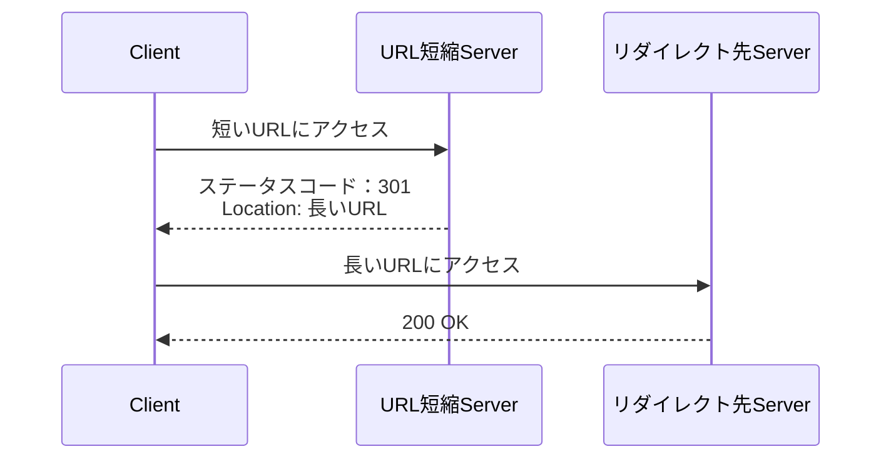
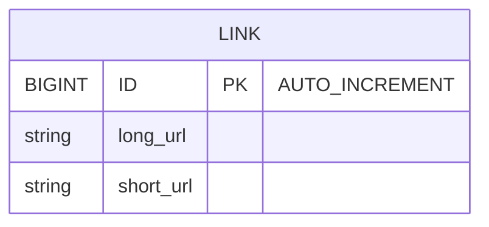
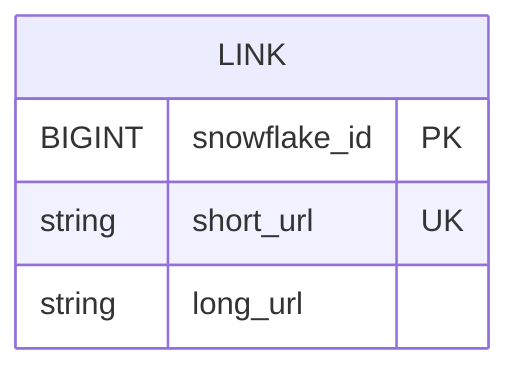

# AWS上でURL短縮サービスを設計する

## 参考文献

AWS上のシステム設計
https://learning.oreilly.com/library/view/awsshang-nosisutemushe-ji/9798341634060/

システム設計の面接試験
https://www.amazon.co.jp/%E3%82%B7%E3%82%B9%E3%83%86%E3%83%A0%E8%A8%AD%E8%A8%88%E3%81%AE%E9%9D%A2%E6%8E%A5%E8%A9%A6%E9%A8%93-%E3%82%A2%E3%83%AC%E3%83%83%E3%82%AF%E3%82%B9%E3%83%BB%E3%82%B7%E3%83%A5%E3%82%A6/dp/4802614063

## システム要件

- システムは、長いURLを入力として受け取り、短縮URLを返す
- 短縮URLは、どこユーザーがアクセスしても長いURLにリダイレクトされなければならない
- トラフィック量は1日あたり1億件のURLが生成を可能にする
- 短縮URLの長さは可能な限り短くする
- 短縮URLは[0-9a-zA-Z]を許可する
- 簡便のため短縮URLの削除や更新は不要

### 見積もり

- 書き込み操作：1日あたり1億件のURLが生成される
- 1秒あたりの書き込み回数：1億回/24/60/60＝1160回
- 読み込み処理：書き込みと読み込みの比率を10:1とすると、1秒あたり読み込み回数：1160*10=11600回
- このサービスが10年稼働すると仮定して、1億*365*10=3650億レコード
- 平均的なURLの長さを100と仮定する
- 10年間に必要なストレージ容量：3650億*100バイト=36.6TB

## デザインから始める

### APIエンドポイント
RESTful APIで設計します

1. URLの短縮：新しいURLを作成するためPOSTリクエストとする
```
POST /v1/links
{
    longUrl
}
短縮URLを返します
```
/v1/shortLinksみたいにしてもいいが、このサービスはURL短縮サービスのためlinksのみで十分に思う
> 参考文献では以下のようなエンドポイントにしていますが、以下の理由により/v1/linksとしました。
> AWS上のシステム設計：POST /v1/createShortUrl
> ・動詞（create）が入っていてRPC的。将来「更新・一覧・削除」をどう命名するか一貫性が崩れやすい
> システム設計の面接試験：POST api/v1/data/shorten
> ・data/は汎用的すぎて意味が薄く。不要に階層を深くしているように思う。shortenも動詞である。

2. URLのリダイレクト：短縮URLを長いURLにリダイレクトする
```
GET /v1/links/{id}
リダイレクトのために長いURLを返します
```
> 参考文献では以下のようなエンドポイントにしていますが、上記と同様の理由かつ一貫性を持たせるため/v1/linksとする。
> AWS上のシステム設計：GET v1/getLongUrl
> システム設計の面接試験：GET api/v1/shortUrl

### URLリダイレクト


ここで1つ議論に値するのは、301リダイレクトと302リダイレクトの比較です。

301リダイレクトの場合
要求されたURLが恒久的に長いURLに移動される。恒久的のためブラウザはレスポンスをキャッシュし、同じURLに対数るその後のリクエストはURL短縮サービスに送られることはない
- メリット
  - サーバー負荷を軽減できる
- デメリット
  - 分析を重視する場合にクリック率やクリック元などの追跡ができない

302リダイレクトの場合
- メリット
  - 分析機能の充実が可能になる
- デメリット
  - サーバー負荷が大きくなる

### URLの短縮
短いURLが、tinyurl.com/[ハッシュ値]のようなものであると仮定する
そうするにはハッシュ値にマッピングするハッシュ関数fxを作らないといけない

ハッシュの長さ
ハッシュ値は[0-9a-zA-Z]の文字からなり、10+26+26=62文字が使える
必要な長さは62^n>=3650億のnを求めればよい。
n=6で約600億のため、3.5兆あるn=7とする
結果、ハッシュ値の長さは7とする

### BASE62変換
簡単な解決策として、MD5,SHA-1などのハッシュ関数を使用して先頭7文字を使う、かつ、衝突判定で衝突しなくなるまで生成を繰り返すという手法もありますが、衝突判定をするためにDBに問い合わせる必要があるため、BASE62変換を使うようにします。
BASE62変換は簡単に言うと「数値を62進数で表現すること」です。

例えば、以下テーブルがあるとします。
このIDをBASE62変換した値を短縮URLのハッシュ値とします。

こうすることで、レコード数が3650億でもハッシュ値は`6QPenmC`となり、7文字の要件を満たせます。さらに、主キーのIDを使うため衝突判定も不要になります。
そして、62^7の3.5兆を使い果たしたとしても、62進数のため4兆をBASE変換すると`18QB6MKG`になり、7文字は超えますが、想定外にこのサービスが使われたとしても耐えうる設計になります。

BASE62変換の例
Base62 (1) = 1
Base62 (10) = A
Base62 (61) = z
Base62 (62) = 10
Base62 (63) = 11
Base62 (1000001) = 4C93
Base62 (365000000000) = 6QPenmC

ですが、1台のRDBでAUTO_INCREMENTを使うと単一障害点になり、水平スケーリングが難しくなります。これを解消する方法がsnowflakeです。

### 分散型ユニークIDジェネレータ
AUTO_INCREMENTの代わりにsnowflakeを使います。
snowflakeとはX（旧Twitter）によるIDジェネレータシステムで、以下のように設計されています。

- 1bit 符号：正の数にする
- 41bit タイムスタンプ：基準時間（サービス開始時）からの経過ミリ秒（69年間動作可能）
- 5bit データセンターID：2^5=32データセンタ
- 5bit マシンID：2^5=32台のマシン
- 12bit シーケンス：マシンのプロセスでIDが生成されるたびにシーケンス番号を1ずつ増加する。1ミリ秒ごとにリセット

これにより、水平スケーリングしても一意のIDを生成できます。

### データモデルとデータベース
短縮URLと長いURLのマッピングの格納については、リレーショナルデータベースでも非リレーショナルデータベースでも解決可能です。

予想されるクエリパターンは
- 特定の短いURLに対して長いURLを取得する
- 特定の長いURLから短いURLを取得する

であり、将来の拡張性を考慮してもjoinや複雑な検索も不要だと思われるため、
トラフィック増による水平スケーリングのしやすいAmazon DynamoDBを採用する



> 参考文献では以下のようなキー生成にしていますが、システム的なシンプルさを維持しながらスケーリングを考えた設計にしたいのでこのようにしました。（プロダクトの初期段階から設計を過剰スペックにするのはコストが見合わないで注意が必要です）
> 
> AWS上のシステム設計：キー生成サービスを作り、RDBのAUTO_INCREMENTを使い、偶数でID増加するRDBと奇数で増加するIDの2台のRDBで設計している（備考でsnowflakeの記述あり）。短縮URLと長いURLは鍵生成サービスとは別でDynamoDBに保存するようにしている。
> 
> システム設計の面接試験：RDBで1つのテーブルにID、short_url、long_urlがある。IDがPKになっているが、IDの採番については別の章（分散型ユニークIDジェネレータ）を参照するように記述がある。

### URL短縮生成時の流れ

1. 長いURLが入力される
2. 長いURLがデータベースにあるかチェックする
3. データベースに存在する場合、長いURLはすでに短縮URLが生成されたことを意味するため、データベースの短縮URLを返す
4. そうでない場合、長いURLは新しいものであるため、snowflake IDを生成する
5. IDをBASE62で短いURLに変換する
6. ID、短縮URL、長いURLをデータベースに保存する

### 短縮URLクリック時の流れ
書き込みよりも読み込みの方が多いので、＜短縮URL、長いURL＞のマッピングをキャッシュに保存してパフォーマンスを向上させます。

1. ユーザーが短縮URLのリンクをクリックする
2. ロードバランサがWebサーバにリクエストを転送する
3. 短縮URLがすでにキャッシュがある場合、長いURLを直接返す
4. キャッシュにない場合、長いURLをデータベースから取得する
5. 長いURLがユーザーに返される

## AWS上でシステムを起動する

## システム要件
