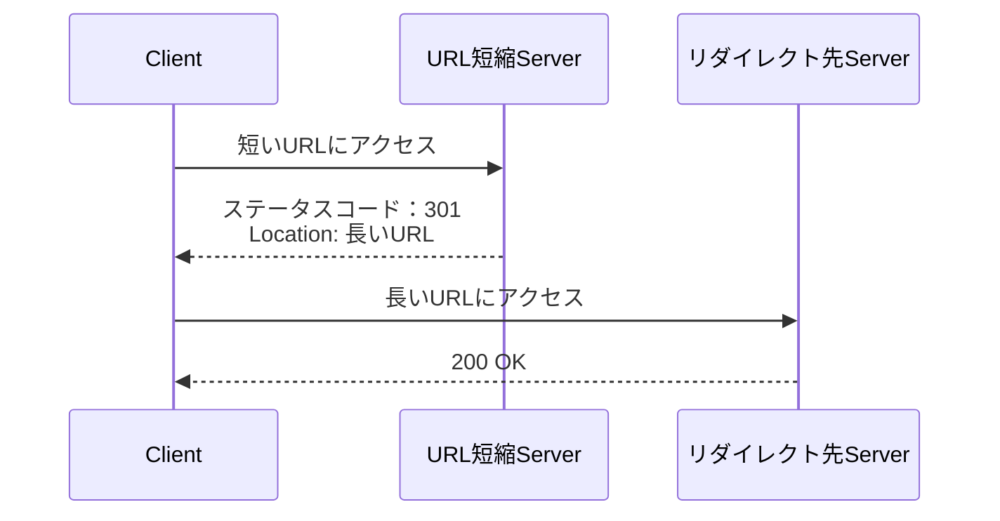
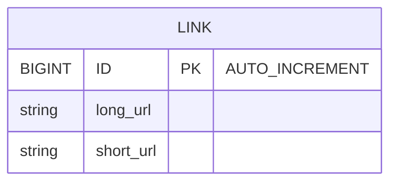
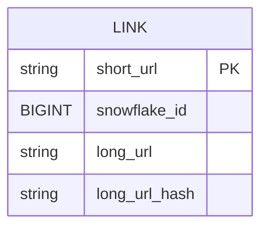

# AWS上でURL短縮サービスを設計する

## はじめに
参考文献にある2冊の本を読んで、私なりの考えでURL短縮サービスを設計していきます。
よりよい設計にするために、設計に不備や改善点がありましたらご指摘ください。

## 参考文献

AWS上のシステム設計
https://learning.oreilly.com/library/view/awsshang-nosisutemushe-ji/9798341634060/
主に「第14章 URL短縮サービスの設計 URL短縮サービスをデザインする」を参考にしてます。

システム設計の面接試験
https://www.amazon.co.jp/%E3%82%B7%E3%82%B9%E3%83%86%E3%83%A0%E8%A8%AD%E8%A8%88%E3%81%AE%E9%9D%A2%E6%8E%A5%E8%A9%A6%E9%A8%93-%E3%82%A2%E3%83%AC%E3%83%83%E3%82%AF%E3%82%B9%E3%83%BB%E3%82%B7%E3%83%A5%E3%82%A6/dp/4802614063
主に「8章 URL短縮サービスの設計」を参考にしてます。

## システム要件

- システムは、長いURLを入力として受け取り、短縮URLを返す
- 短縮URLは、どこユーザーがアクセスしても長いURLにリダイレクトされなければならない
- トラフィック量は1日あたり1億件のURLが生成を可能にする
- 短縮URLの長さは可能な限り短くする
- 短縮URLは[0-9a-zA-Z]を許可する
- 簡便のため短縮URLの削除や更新は不要

### 見積もり

- 書き込み操作：1日あたり1億件のURLが生成される
- 1秒あたりの書き込み回数：1億回/24/60/60＝1160回
- 読み込み処理：書き込みと読み込みの比率を10:1とすると、1秒あたり読み込み回数：1160*10=11600回
- このサービスが10年稼働すると仮定して、1億*365*10=3650億レコード
- 平均的なURLの長さを100と仮定する
- 10年間に必要なストレージ容量：3650億*100バイト=36.6TB

## デザインから始める

### APIエンドポイント
RESTful APIで設計します

1. URLの短縮：新しいURLを作成するためPOSTリクエストとする
```
POST /v1/links
{
    longUrl
}
```

/v1/shortLinksみたいにしてもいいですが、このサービスはURL短縮サービスのためlinksのみで十分に思います。
> 参考文献では以下のようなエンドポイントにしていますが、以下の理由により/v1/linksとしました。
> AWS上のシステム設計：POST /v1/createShortUrl
> ・動詞（create）が入っていてRPC的。将来「更新・一覧・削除」をどう命名するか一貫性が崩れやすい
> システム設計の面接試験：POST api/v1/data/shorten
> ・data/は汎用的すぎて意味が薄く。不要に階層を深くしているように思う。shortenも動詞である。

2. URLのリダイレクト：短縮URLを長いURLに301リダイレクトする
```
GET /v1/links/{id}
```

> 参考文献では以下のようなエンドポイントにしていますが、上記と同様の理由かつ一貫性を持たせるため/v1/linksとする。
> AWS上のシステム設計：GET v1/getLongUrl
> システム設計の面接試験：GET api/v1/shortUrl

### URLリダイレクト


ここで1つ議論に値するのは、301リダイレクトと302リダイレクトの比較です。

301リダイレクトの場合
要求されたURLが恒久的に長いURLに移動される。恒久的のためブラウザはレスポンスをキャッシュし、同じURLに対するその後のリクエストはURL短縮サービスに送られることはない
- メリット
  - サーバー負荷を軽減できる
- デメリット
  - 分析を重視する場合にクリック率やクリック元などの追跡ができない

302リダイレクトの場合
- メリット
  - 分析機能の充実が可能になる
- デメリット
  - サーバー負荷が高くなる

今回、分析の要件はないため301ダイレクトにします。

### URLの短縮
短いURLが、tinyurl.com/[ハッシュ値]のようなものであると仮定する
そうするにはハッシュ値にマッピングするハッシュ関数fxを作らないといけない

ハッシュの長さ
ハッシュ値は[0-9a-zA-Z]の文字からなり、10+26+26=62文字が使える
必要な長さは62^n>=3650億のnを求めればよい。
n=6で約600億のため、3.5兆あるn=7とする
結果、ハッシュ値の長さは7とする

### BASE62変換
簡単な解決策として、MD5,SHA-1などのハッシュ関数を使用して先頭7文字を使う、かつ、衝突判定で衝突しなくなるまで生成を繰り返すという手法もありますが、衝突判定をするためにDBに問い合わせる必要があるため、BASE62変換を使うようにします。
BASE62変換は簡単に言うと「数値を62進数で表現すること」です。

例えば、以下テーブルがあるとします。
このAUTO_INCREMENTのIDをBASE62変換した値を短縮URLのハッシュ値とします。

こうすることで、レコード数が3650億でもハッシュ値は`6QPenmC`となり、7文字の要件を満たせます。さらに、主キーのIDを使うため衝突判定も不要になります。
そして、62^7の3.5兆を使い果たしたとしても、62進数のため4兆をBASE変換すると`18QB6MKG`になり、7文字は超えますが、想定外にこのサービスが使われたとしても耐えうる設計になります。

BASE62変換の例
Base62 (1) = 1
Base62 (10) = A
Base62 (61) = z
Base62 (62) = 10
Base62 (63) = 11
Base62 (1000001) = 4C93
Base62 (365000000000) = 6QPenmC

ですが、1台のRDBでAUTO_INCREMENTを使うと単一障害点になり、水平スケーリングが難しくなります。これを解消する方法がsnowflakeです。

### 分散型ユニークIDジェネレータ
AUTO_INCREMENTの代わりにsnowflakeを使います。
snowflakeとはX（旧Twitter）によるIDジェネレータシステムで、以下のように設計されています。

- 1bit 符号：正の数にする
- 41bit タイムスタンプ：基準時間（サービス開始時）からの経過ミリ秒（69年間動作可能）
- 5bit データセンターID：2^5=32データセンタ
- 5bit マシンID：2^5=32台のマシン
- 12bit シーケンス：マシンのプロセスでIDが生成されるたびにシーケンス番号を1ずつ増加する。1ミリ秒ごとにリセット

これにより、水平スケーリングしても一意のIDを生成できます。

### データモデルとデータベース
短縮URLと長いURLのマッピングの格納については、リレーショナルデータベースでも非リレーショナルデータベースでも解決可能です。

予想されるクエリパターンは
- 特定の短いURLに対して長いURLを取得する
- 特定の長いURLから短いURLを取得する

であり、将来の拡張性を考慮してもjoinや複雑な検索も不要だと思われるため、
トラフィック増による水平スケーリングのしやすいAmazon DynamoDBを採用する


短縮URLの存在チェックの高速化のために、long_urlにGlobal Secondary Indexを設定が必要です。ですが、GSIには最大2KBの長さ制限があるため、long_url_hashを追加してGSIを設定します。

> 参考文献では以下のようなキー生成にしていますが、システム的なシンプルさを維持しながらスケーリングを考えた設計にしたいのでこのようにしてます。（プロダクトの初期段階から設計を過剰スペックにするのはコストが見合わないで注意が必要です）
> 
> AWS上のシステム設計：キー生成サービスを作り、RDBのAUTO_INCREMENTを使い、偶数でID増加するRDBと奇数で増加するIDの2台のRDBで設計している。短縮URLと長いURLは鍵生成サービスとは別でDynamoDBに保存するようにしている。（備考でsnowflakeの記述あり）
> 
> システム設計の面接試験：RDBで1つのテーブルにID、short_url、long_urlがある。IDがPKになっているが、IDの採番については別の章（分散型ユニークIDジェネレータ）を参照するように記述がある。

### URL短縮生成時の流れ

1. 長いURLが入力される
2. 長いURLがデータベースにあるかチェックする
3. データベースに存在する場合、長いURLはすでに短縮URLが生成されたことを意味するため、データベースの短縮URLを返す
4. そうでない場合、長いURLは新しいものであるため、snowflake IDを生成する
5. IDをBASE62で短いURLに変換する
6. ID、短縮URL、長いURLをデータベースに保存する

### 短縮URLクリック時の流れ
書き込みよりも読み込みの方が多いので、＜短縮URL、長いURL＞のマッピングをキャッシュに保存してパフォーマンスを向上させます。

1. ユーザーが短縮URLのリンクをクリックする
2. ロードバランサがWebサーバにリクエストを転送する
3. 短縮URLがすでにキャッシュがある場合、長いURLを直接返す
4. キャッシュにない場合、長いURLをデータベースから取得する
5. 長いURLがユーザーに返される

## AWS上でシステムを起動する

管理コストが低く、オートスケール可能という観点でAWS上の設計を行います。

> 主にAWS上のシステム設計を参考に設計してます。DAXなどの構成要素はこの本に出てきます。Day 0アーキテクチャの最小実行可能プロダクトから、数百万人それ以上へにスケーリングするDay Nアーキテクチャの大きく2種類のアーキテクチャの紹介があり、それら複数のアーキテクチャのよさそうなところを選んで設計しました。


- CloudFront：より高速なコンテンツデリバリーのためにCDNを利用する
    - 短縮URLがキャッシュされている場合、キャッシュされた値を返すためレイテンシが早くなる
- VPC：リソースを隔離・制御する
  - LB：負荷分散のためLBを利用する
  - AZ：高可用性のためにAZを2つにする
    - Fargate：管理コストが低く、スケーラビリティがある
      - [他の選択肢との比較]
        - EC2：OS更新など管理コストが高いため
        - ECS on EC2：Fargateの方が管理コストが低いため
        - Lambda：コールドスタート問題によりレイテンシが増えるため
      - [もし]トラフィックがさらに増えたら
        - 短縮URL生成と短縮URL読み込みを分離する
            - 短縮URLの生成はsnowflakeを使っているため、1データセンターあたり32台までしか増やせない。読み込みはID生成しないため制限はないため分離して、それぞれに合ったマシンスペックに変更する
    - DAX：DynamoDBに頻繁にアクセスされるデータをキャッシュする。導入が簡単。
      - [他の選択肢との比較]
        - Redis：自由度は高いが、アプリケーション側の処理が増え、管理コストが上がる。要件的に、DAXで十分に思う。
- DynamoDB：スケーリングに強く。要件的に複雑な検索も不要のため
  - 更新処理はないため結果整合にします。
  - [他の選択肢との比較]
    - RDB：シャーディングや水平スケーリングの管理コストが高いため。ただし、DynamoDBの知見が浅い場合はRDBを採用したい
- Route 53：ドメインの管理
- CloudWatch：ロギングとモニタリング
- IAM：AWSリソースへのアクセス制御
- Certificate Manager：ドメインのSSL/TLS証明書管理

### この設計で耐えられるトラフィック量

トラフィック量の肌感覚がないため、LLMに推計させます。

#### Q：この設計で、書き込み操作：1日あたり何件のURLの生成に耐えられる？
A：この設計（Snowflake + Base62 + ALB/Fargate + DynamoDB＋GSI＋DAX）なら、書き込みは “少なくとも” 1日あたり3.4億件、設定次第では数十億件/日まで伸ばせます。

SnowflakeのID生成能力：1ノードあたり 4,096 ID/ミリ秒 ＝ 約 4.096M ID/秒。これは 1日あたり約3,540億ID/日
DynamoDB（オンデマンド）の初期上限感：新規テーブルは即時に ~4,000 writes/秒 をさばけるため、4,000 × 86,400 ≒ 3.46億件/日
GSIの書き込み増幅：long_url に GSI を張る設計なので、テーブルへの1回の書き込みはGSI側にも“もう1回”の書き込みが走り、その分 GSI側のWCUも消費します。したがって実効的には2倍の書き込みコストを見込みます

GSIありでも新規テーブルの初期性能だけで ~1.7億件/日。
スケール後やクォータ拡張で 十億件/日クラスまで到達可能。

[所感]ボトルネックになりえるのはDynamoDBのようです。ですが、要件の1億件/日は満たしているのでよさそうです。

#### Q：この設計で、1秒あたり何回の読み込み処理に耐えられる？
A：読み込みQPSはキャッシュのヒット率とDynamoDBのRCU設定でほぼ決まります。例えばCloudFrontヒット率=0.5、DAXヒット率＝0.90、RCU(Read Capacity Unit)＝5k、アイテム<4kb（結果整合のためr=0.5）なら約20万RPS が目安。

$$
\textbf{RPS}{\max} \approx \dfrac{RCU/r}{(1-H_{cf})(1-H_{dax})}
$$

[所感]ヒット率が高いように思いますが、短縮URLサービスの特性上、人気なURLほどリクエストが多いはずなので、大きく間違ってはないように思います。また、要件の1.16万RPSは満たしているのでよさそうです。

#### Q：この設計で、DynamoDBに3650億レコードの36.6TBあっても耐えられる？
A：DynamoDBはテーブルサイズに実質上限なし（ペタバイト級でも運用例あり）で、自動パーティション（~10GB/パーティション目安）＆スループット自動分割が効くため、ストレージ量自体は問題になりません。あなたのスループット見積り（1,160 writes/s, 11,600 reads/s）もDynamoDBの設計範囲に十分収まる値です。

[所感]要件の3650億レコードの36.6TBは満たしているのでよさそうです。

### コスト計算

力尽きたのでコスト計算もLLMにやらせます。

#### Q：コストを見積もって
A：

##### 前提

* 生成（書込）：**1億件/日** ⇒ **30億件/月**
* クリック（読込）：**11,600 RPS** ⇒ **300.672 億リクエスト/月**
* 301 リダイレクト（HTML本文は極小）
* CloudFront ヒット率 **0.5**、DAX ヒット率 **0.9**（＝**DB 到達は全体の 5%**）
* DynamoDB アイテムは **≤1KB**、読み取りは**結果整合**（0.5 RRU/リクエスト）
* GSI に long_url_hash を張るため **書込は 2 倍課金**（テーブル + GSI）
* ストレージは 10 年後の**36.6 TB**を**定常月**の概算として提示（途中成長なら当然もっと安くなります）

##### 合計の目安（大きな桁だけ）

* **CloudFront**：**~ $302.5K / 月**
* **DynamoDB**：**~ $18.1K / 月**
* **ALB + Fargate**：**~ $0.13–0.5K / 月**
* **Route 53 + CloudWatch 等**：**数十ドル / 月**

**トータル概算**：**~ $320K / 月 前後**
（**最大要因は CloudFront の「リクエスト課金」**。DB/アプリではなくエッジ側が支配的）

##### コストの詳細

###### 1) DynamoDB（オンデマンド）

* **書込**：30 億 WRU / 月 × **$1.25 / 100万** × **2（GSI 分）**
  ≈ **$7,500/月**
* **読込（DB 到達は全体の 5%）**：
  全体 300.672 億 × 5% = **15.0336 億 req / 月**
  結果整合 → **0.5 RRU/req** ⇒ 7.5168 億 RRU / 月 × **$0.25/100万**
  ≈ **$188/月**（※フル到達なら ≈$3,758/月）
* **ストレージ（標準テーブルクラス）**：**36.6 TB** × **$0.285/GB-月（Tokyo 実勢）**
  ≈ **$10,431/月**（ストレージが一番効きます）

**小計（DynamoDB）**：**約 $18.1K / 月**（= 書込 $7,500 + 読込 $188 + 保管 $10,431）

###### 2) CloudFront（リダイレクト配信）

* **リクエスト課金**：300.672 億 リクエスト / 月 × **$1.0 / 100万**（HTTPS/100万あたりの代表値）
  ≈ **$300,672/月**（※ここが最も大きい可能性）
* **データ転送（エッジ→ユーザー）**：レスポンスは 301 + Location ヘッダのみで極小。
  仮に**0.5 KB/レスポンス**と置くと **約 15 TB/月**。アジアの単価を **$0.12/GB** と置くと
  15,360 GB × $0.12 ≈ **$1,843/月**

**小計（CloudFront）**：**約 $302.5K / 月**

---

###### 3) アプリ層（ALB + Fargate）

* **ALB**：ベース時間料金 + LCU 課金。トラフィック 5% がオリジンへ。ルールやコネクション次第ですが、
  代表的な**数十ドル〜数百ドル/月**レンジ。ここでは **$50〜$300/月**でレンジ提示。
* **Fargate**：読込/書込合計 ~1.7k RPS でも軽量 API なら小さめタスクで十分。
  例）**0.25 vCPU / 0.5 GB × 8 タスク × 24h × 30日**で概算 **$80〜$200/月**

**小計（アプリ）**：**~ $130〜$500 / 月**

---

###### 4) 周辺（Route 53 / CloudWatch / ACM）

* **Route 53**：ホストゾーン **$0.50/月** + DNS 標準クエリ **$0.40/100万**（初期は微々たる額）
* **CloudWatch Logs/メトリクス**：取り方次第（数〜数十ドル/月規模になりがち）
* **ACM**：パブリック証明書は **無料**。

---

$320,000 * 150円 = 4800万円！！！

高っ

CloudFrontをなくしても要件を満たせそうなので、なくしてもいいかもですね。
CloudFrontヒット率=0.0、DAXヒット率＝0.5として計算すると、(5000/0.5)/((1-0.0)*(1-0.5))=2万RPSになります。

一応、4800万円でも儲けることができるか計算してみます。

書き込み1件あたり、4800万/30億＝0.016円
読み込み1件あたり、4800万/300億＝0.0016円

SaaSの一般的な粗利率は聞いたら70〜80%以上が業界標準らしい。

ケース1）短縮URL1件生成あたり料金をとるなら

粗利率80%の場合、0.016/(1-0.8)=0.08円
既存の短縮URLサービスで1件生成するごとに料金をとるサービスがあれば持続可能かわかりましたが、なさそうなので不明です。

ケース2）短縮URL生成時に広告を見せるなら

Google広告で1回の表示あたり0.1円くらい？
だとしたら、粗利80%の0.08円より高いのでよさそうですね。
